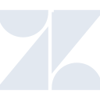

# zendesk

[← Back to main README](../../README.md)

<table><tr>
  <td></td>
  <td></td>
  <td></td>
</tr></table>

## 16 px

### black
```
https://georgegach.github.io/compatible-icons/simple-icons/compat/zendesk/16/black.png
```

### slate
```
https://georgegach.github.io/compatible-icons/simple-icons/compat/zendesk/16/slate.png
```

### white
```
https://georgegach.github.io/compatible-icons/simple-icons/compat/zendesk/16/white.png
```

## 64 px

### black
```
https://georgegach.github.io/compatible-icons/simple-icons/compat/zendesk/64/black.png
```

### slate
```
https://georgegach.github.io/compatible-icons/simple-icons/compat/zendesk/64/slate.png
```

### white
```
https://georgegach.github.io/compatible-icons/simple-icons/compat/zendesk/64/white.png
```

## 128 px

### black
```
https://georgegach.github.io/compatible-icons/simple-icons/compat/zendesk/128/black.png
```

### slate
```
https://georgegach.github.io/compatible-icons/simple-icons/compat/zendesk/128/slate.png
```

### white
```
https://georgegach.github.io/compatible-icons/simple-icons/compat/zendesk/128/white.png
```

## 512 px

### black
```
https://georgegach.github.io/compatible-icons/simple-icons/compat/zendesk/512/black.png
```

### slate
```
https://georgegach.github.io/compatible-icons/simple-icons/compat/zendesk/512/slate.png
```

### white
```
https://georgegach.github.io/compatible-icons/simple-icons/compat/zendesk/512/white.png
```

## 1024 px

### black
```
https://georgegach.github.io/compatible-icons/simple-icons/compat/zendesk/1024/black.png
```

### slate
```
https://georgegach.github.io/compatible-icons/simple-icons/compat/zendesk/1024/slate.png
```

### white
```
https://georgegach.github.io/compatible-icons/simple-icons/compat/zendesk/1024/white.png
```

## 16 px in base64

### black
```
data:image/png;base64,iVBORw0KGgoAAAANSUhEUgAAABAAAAAQCAYAAAAf8/9hAAAABmJLR0QA/wD/AP+gvaeTAAABAklEQVQ4jaXTvUoDQRTF8d9GhOALqI0g2FhY2NiJH434AgppRNA+b2CvvoatrViKlURTaKOFaMCP4JaKCuJHsRtYJjtrkQtTnXP/wz13hgErQbNCv0UNk1WQT/xGzgkuKvSXGroR8BsO8BPRn7ECm0gD8kd++xJaJTenaBRpi2jnM19jF9s4KwG8Yr8qE5jDI84DwBeOZOFHawydvKEVAK4wUjTXguY6jjFRAu5gFe8xQIJDTAeNiWxT63gIqUXAHuYxHHi+sYM13MiCbmOhaGroX2Uvg2Wc6n9wKTZgFk8lzT3Almx1Zfr9EC4xGs6WVxfjmIno9f8+012ewVSFZ7D6A0/XYrYmvWqqAAAAAElFTkSuQmCC
```

### slate
```
data:image/png;base64,iVBORw0KGgoAAAANSUhEUgAAABAAAAAQCAYAAAAf8/9hAAAABmJLR0QA/wD/AP+gvaeTAAABk0lEQVQ4jaWSP2hTYRTFf+e+B0qo/9A2EkOhkzhW1NlNFJ0cBCcHwVUh4NzFSQRHBwcHJ0HBrSAUnYuuQtFQqya2xTYQpZC87zhoTfqadOkZv/OdP/dyYZ/Qcrtzdw/6kwrCmWf2MNjcEhwYzfodSROIsyNptBYB7dGkuxH5c0Qane1WRLoUfXsOs16SbyXznn5/aUzxdeHGqaljHwTQXNu4GH09kjhi0yN4HRFL7he3kQI4N5TcRXoyXT3a+Nt0BFZanQuO9ArUwnjbQKIPelOfOnxFkgGiLG6udk+a9AKr9k88yIaPWfHr+rZ4l0Gz6YNZ6s0jTe9amVmOXnG5Vqv9Hn6PwQcrq3ReWpzZuS8EtEO6Ua8f/1o2/r+DLz82H2LfAU0M8YvYKfL8aUrpNMlXEblNJ+XZvZnJQ28FsNL+edNkj8EnSgGLCe6HNGdzXnhwcGbduJF9W92YTdYzoFquB3yPLD7LvgVUSt0rIc3mKcU8eHKEGEw4FdfwjrEGtFTNEzwYcw4oqWlRgBfGBOwffwAWvaWVTiOxJgAAAABJRU5ErkJggg==
```

### white
```
data:image/png;base64,iVBORw0KGgoAAAANSUhEUgAAABAAAAAQCAYAAAAf8/9hAAAABmJLR0QA/wD/AP+gvaeTAAABGUlEQVQ4jaWTvy8EURhFz5sQIlqhkkg0SgqdEI0otCQaDb1CL1r8G1qtaKlkZRUaIhs28SuZ7YhsIhzFzibjmRnF3vZ+9+R7970HPSqo2xV+A0iAiSpAGxgo8c+AYWCmxE8T4LXEfAeOgO8S/wVYSoA9oBWZbaAO3JWEW8BOCOEKAHVBrasN9UbdV7fUC7Xmb72phyVgusBZ9Um9jACf6okaqsJjajML1CLAtTqUn0+i8CBwCowXsJvAcgjhoxCQrXUMTEXBQOem1kIIjzE1v8EBMAf0RzNfwC6wqt5mRdfV+fzq62rqX9XURfVcbUdeqm6gTqvPBeEuYDO7uiI99GWljRSU1j3iCp3nXKTR/z7TfdbBZMVMb/oBdAIjk7yVOF8AAAAASUVORK5CYII=
```

