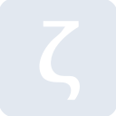
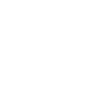

# zettlr

[← Back to main README](../../README.md)

<table><tr>
  <td></td>
  <td></td>
  <td></td>
</tr></table>

## 16 px

### black
```
https://georgegach.github.io/compatible-icons/simple-icons/compat/zettlr/16/black.png
```

### slate
```
https://georgegach.github.io/compatible-icons/simple-icons/compat/zettlr/16/slate.png
```

### white
```
https://georgegach.github.io/compatible-icons/simple-icons/compat/zettlr/16/white.png
```

## 64 px

### black
```
https://georgegach.github.io/compatible-icons/simple-icons/compat/zettlr/64/black.png
```

### slate
```
https://georgegach.github.io/compatible-icons/simple-icons/compat/zettlr/64/slate.png
```

### white
```
https://georgegach.github.io/compatible-icons/simple-icons/compat/zettlr/64/white.png
```

## 128 px

### black
```
https://georgegach.github.io/compatible-icons/simple-icons/compat/zettlr/128/black.png
```

### slate
```
https://georgegach.github.io/compatible-icons/simple-icons/compat/zettlr/128/slate.png
```

### white
```
https://georgegach.github.io/compatible-icons/simple-icons/compat/zettlr/128/white.png
```

## 512 px

### black
```
https://georgegach.github.io/compatible-icons/simple-icons/compat/zettlr/512/black.png
```

### slate
```
https://georgegach.github.io/compatible-icons/simple-icons/compat/zettlr/512/slate.png
```

### white
```
https://georgegach.github.io/compatible-icons/simple-icons/compat/zettlr/512/white.png
```

## 1024 px

### black
```
https://georgegach.github.io/compatible-icons/simple-icons/compat/zettlr/1024/black.png
```

### slate
```
https://georgegach.github.io/compatible-icons/simple-icons/compat/zettlr/1024/slate.png
```

### white
```
https://georgegach.github.io/compatible-icons/simple-icons/compat/zettlr/1024/white.png
```

## 16 px in base64

### black
```
data:image/png;base64,iVBORw0KGgoAAAANSUhEUgAAABAAAAAQCAYAAAAf8/9hAAAABmJLR0QA/wD/AP+gvaeTAAABB0lEQVQ4jZ3TMUpDQRDG8d8zUVErK8XOygPYCjYW2ipeQOy9gGfwHHa2eobYWYkINsaAolGCIYkhFrsvhPXtK/xgdmFn9j/LzGyBS+xiBQ0soKlefXziCjqY/NM6BQYx66ze0U3OCqxheebsp1xS8hOOo+3H4B28JXGjHKC0bxziBM8V/mEdoIMjnOE1E5MF9HCOvZrLU8C4wvEgtPS25vIEwznVakXwasY/VQ7Qjns3ZsppUsRMKege21jEKdZxgC1hHkplazDCo1CDa6GYG/62ckD9HJTWioB2CpiLgDp94Q4XwijPaqziWan1hb8xqPC9NOLTNoW+jzCfZGliKfrLwvXwgZtfW2ycNsSkk7wAAAAASUVORK5CYII=
```

### slate
```
data:image/png;base64,iVBORw0KGgoAAAANSUhEUgAAABAAAAAQCAYAAAAf8/9hAAAABmJLR0QA/wD/AP+gvaeTAAABdUlEQVQ4jY2TsWoUYRSFvzMzbjQBNURcEYJg4wPYCtZW+gDa+RD2FiqIlYVvoJ2WeYeUgmDpCu5GNNkxmMjuzn4WSyQ7uxu85eU/59xzz/3TG9TvgLvRDWOZpKNUnFV6bFIr79Mb1AOweyZgde1V4OaigPtJhq12Al1h/V8DtqqQUpx7WaQ4nOoTgKLM4fbVSztfvu/fYVp+ANc5xZCvg3oilsvmCx434WFheVmbp0muz00axsUqc8JeM82jUrZx+qINPqnl2w6/Na+jteQN4coqoULMgrr2b3QvPqPgOawGAyy1EIrdJA1ZTOi/CNBvADFDaUV0WkhMbzBs2kTK57X8uT0eX1ijymPjNfVeklvMWx4tJQhMhB7hAPjhZPIyHT8xrXZxLo1RBVmY0lk6N0/aRVltyfi+kvbGC3SyyuOMzF/CR5pzr0Jaf8amIvkJLj2SmZ10kAeEjbZVSV1M9S2kDxwFjpZwnCdsAh0AZSTWYD9x5y8836vwURTjGwAAAABJRU5ErkJggg==
```

### white
```
data:image/png;base64,iVBORw0KGgoAAAANSUhEUgAAABAAAAAQCAYAAAAf8/9hAAAABmJLR0QA/wD/AP+gvaeTAAABLklEQVQ4jYXTsUpcQRjF8d/oEkWbSAQlkMYmD2ArpLbyBZLOh7C3CoRUFnkD0yWl76CdIAS7QKJCUJOQmGx2ORb3Lqx3dzZ/uNx7ZzjnzDfzTUnyHi+wjHk8Qs9s7vAdH0qSS6z9R1DjqiT526aOc43bzlhpg5bGxga9dtldfmJv9F1KOUqyhY8dAyXJoGJCU+tLPMY+nnbm/81VhHCFV3iG11PEqO/2LxxodvodVqsxSYaZ5DzJfJKTKXPj9GslHJdShliZUSKoGXxt37fIDH1KkuEUo0/YxAJ2sY5tPNf0w4h+zWCAz7jBN7zBGY49PI1+r7LEHjbG/p9gp5NOmzyoVtjwA6d4a/LODEuSLypN0vJH05HLJu/M5RwOcYHf7dNlUXOcI3Ff02AXOLoHMmKPtHze+qcAAAAASUVORK5CYII=
```

