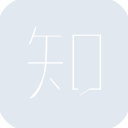
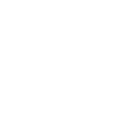

# zhihu

[← Back to main README](../../README.md)





## 16 px

### black
```
https://georgegach.github.io/compatible-icons/simple-icons/zhihu/16/black.png
```

### slate
```
https://georgegach.github.io/compatible-icons/simple-icons/zhihu/16/slate.png
```

### white
```
https://georgegach.github.io/compatible-icons/simple-icons/zhihu/16/white.png
```

## 64 px

### black
```
https://georgegach.github.io/compatible-icons/simple-icons/zhihu/64/black.png
```

### slate
```
https://georgegach.github.io/compatible-icons/simple-icons/zhihu/64/slate.png
```

### white
```
https://georgegach.github.io/compatible-icons/simple-icons/zhihu/64/white.png
```

## 128 px

### black
```
https://georgegach.github.io/compatible-icons/simple-icons/zhihu/128/black.png
```

### slate
```
https://georgegach.github.io/compatible-icons/simple-icons/zhihu/128/slate.png
```

### white
```
https://georgegach.github.io/compatible-icons/simple-icons/zhihu/128/white.png
```

## 512 px

### black
```
https://georgegach.github.io/compatible-icons/simple-icons/zhihu/512/black.png
```

### slate
```
https://georgegach.github.io/compatible-icons/simple-icons/zhihu/512/slate.png
```

### white
```
https://georgegach.github.io/compatible-icons/simple-icons/zhihu/512/white.png
```

## 1024 px

### black
```
https://georgegach.github.io/compatible-icons/simple-icons/zhihu/1024/black.png
```

### slate
```
https://georgegach.github.io/compatible-icons/simple-icons/zhihu/1024/slate.png
```

### white
```
https://georgegach.github.io/compatible-icons/simple-icons/zhihu/1024/white.png
```

## 16 px in base64

### black
```
data:image/png;base64,iVBORw0KGgoAAAANSUhEUgAAABAAAAAQCAYAAAAf8/9hAAAABmJLR0QA/wD/AP+gvaeTAAAA90lEQVQ4jaXTzUrDUBAF4K9BEKVqrbhp8QnE918bcOsLKIJC60LFBjT4m7q4E0xaqykeGLhJ5pw7Z2YCQ+SYosT8jygjNw+uHFUH4mJUOBVqzQ8zvHcUmWYY+MZrlLihGwa9UKpxg+sQ3cc2+jjHUeTMcFwTFm/awgnu4zzEHfYwjpynJiFrnOdx2wA9qQ+1rWqVh6ZADw+4xCSIVzhYRf7JQobdEOvjBR+/CWQLzyPJwmaIjFGsUwHc4k3qQRlC4l2hPbWlCh5xJvke4TCs7AT5WZpOC/X+f0pNnGiva72dheVNLFle5XVimklja/nqiDku+Ofv/AWXBH328orGNQAAAABJRU5ErkJggg==
```

### slate
```
data:image/png;base64,iVBORw0KGgoAAAANSUhEUgAAABAAAAAQCAYAAAAf8/9hAAAABmJLR0QA/wD/AP+gvaeTAAABXUlEQVQ4jZWTwWqTURCFv28Ill+ijSndtLirK/ENXPgI9U19Bq1bX8AgaJFSrJiANjbVe1wkhPyiMc5uuHPmnDMz1/Pz2Th3eJG0k8JRoGNLCPNGploTF5z64XL2kuTp8u2/IphXlbST38Czwh87NBB4VIWjdctwA7luZLCThsZosOm55DLhPeZKfUC428Kw9E1oD1ckU/XxUoNdjynQUT4xXKXRIeOSTy3ZV49Xyr9C1pjaMBRhSBhFjNyubZn2NxfrBgEjn4FJyMeCm8A7zMG2MfSHlZR4nyA4lPY9sHUj1U89Shype6EJHhtnuysAtF2EWgC3JNeILnkWJDNINuv7CsKXn/g6rR0Qj7AOg0No9ySzmG9l/9QHwjzQIY0QyTN1vFpVhD2UBMXDHn0yH4RMwY5QyNj+l3ClbP9P/iPTwpqweRm7R5S35YJTkjPIBcn837DMs6w9c1HPfwF9v6qanJe6GQAAAABJRU5ErkJggg==
```

### white
```
data:image/png;base64,iVBORw0KGgoAAAANSUhEUgAAABAAAAAQCAYAAAAf8/9hAAAABmJLR0QA/wD/AP+gvaeTAAABD0lEQVQ4jaXTwS4DYRQF4G8mTYSgVbFpY8dKvIGnr9h6ASIhwQJRCaNKXIu5ZVKqFXf1z809557zn39ERDciBhFxFRFVzK8qZwcR0S0iYoADFP5WgcMSO1PgB7wtQFBgt0Sn0XxBhdaCKjpFRESjcYHzJN3AClZxjO2cGWJvApjetIx93Oa5ixu00c+ZxyagbJwjt3XS32vD1vssD02CAnc4xWUCz7A5C/yThRLrSbaKkTmJlFPfPbWFpSTpq2NdWAFcY6y+g8rXGxknWTO1bwrucaT23cNWWllL8JM6nc8qIqLK5rs641GC5bYiwYX6fpr13ErQcqrpTg1M5Ld/sArDUh1bzBj4rQIn/vs7fwDgVLYjgJbiywAAAABJRU5ErkJggg==
```

