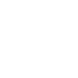

# zig

[← Back to main README](../../README.md)




## 16 px

### black
```
https://georgegach.github.io/compatible-icons/simple-icons/zig/16/black.png
```

### slate
```
https://georgegach.github.io/compatible-icons/simple-icons/zig/16/slate.png
```

### white
```
https://georgegach.github.io/compatible-icons/simple-icons/zig/16/white.png
```

## 64 px

### black
```
https://georgegach.github.io/compatible-icons/simple-icons/zig/64/black.png
```

### slate
```
https://georgegach.github.io/compatible-icons/simple-icons/zig/64/slate.png
```

### white
```
https://georgegach.github.io/compatible-icons/simple-icons/zig/64/white.png
```

## 128 px

### black
```
https://georgegach.github.io/compatible-icons/simple-icons/zig/128/black.png
```

### slate
```
https://georgegach.github.io/compatible-icons/simple-icons/zig/128/slate.png
```

### white
```
https://georgegach.github.io/compatible-icons/simple-icons/zig/128/white.png
```

## 512 px

### black
```
https://georgegach.github.io/compatible-icons/simple-icons/zig/512/black.png
```

### slate
```
https://georgegach.github.io/compatible-icons/simple-icons/zig/512/slate.png
```

### white
```
https://georgegach.github.io/compatible-icons/simple-icons/zig/512/white.png
```

## 1024 px

### black
```
https://georgegach.github.io/compatible-icons/simple-icons/zig/1024/black.png
```

### slate
```
https://georgegach.github.io/compatible-icons/simple-icons/zig/1024/slate.png
```

### white
```
https://georgegach.github.io/compatible-icons/simple-icons/zig/1024/white.png
```

## 16 px in base64

### black
```
data:image/png;base64,iVBORw0KGgoAAAANSUhEUgAAABAAAAAQCAYAAAAf8/9hAAAABmJLR0QA/wD/AP+gvaeTAAABIElEQVQ4jZ3SOy9EURQF4O+aoZGgIZhKp5gClWipRETjH/gfCjqJH6HRqFWmQanQTSOhMEHiOR4hMbmK2ZNcdx4Juznn7LPW2uvsfRL/j2ms9f2DuIgTnGOgiPUOoBcM53IT2Ih1CFVUE6Q5YB2vKHVxkOK2JZoXuEERoz2eUEOCSQFuxQMOMBUAGMEMBuN8jWOs5C2lqOQq9eMsc3+H5birtPK9prCPcuyfsIvDTsBODraClOIDezlOJcNrE1jV7HKKBk797tUvgewU6jjCvOgw3nGFzzgXNaewoNlgWYEaChjv9M7APYarsVYyCfX7AJQi9xXAbLxF1UamaCHBErYxq/mFL7GD55zAt/ZegM1wUcFcF/tdoxjWyrj4Kxl+AAzMTxKEGKP+AAAAAElFTkSuQmCC
```

### slate
```
data:image/png;base64,iVBORw0KGgoAAAANSUhEUgAAABAAAAAQCAYAAAAf8/9hAAAABmJLR0QA/wD/AP+gvaeTAAABnklEQVQ4jZ2SvW4TURCFvzNeoECy3eDYAUfQUaQIHYKOtBGi4QUQiI6OJ4AGIfEaNJQoFTSARIMiqNJECjE4WULAzhJ+IrH3UGBHjhMjhenuaL4zZ2au+M9YXS/OR3Atjgqu5f35zqfey0qkt9jHs7WN/vXxIgXbTtRGc1FRyyndBFo4qsLLxsvq5H2P8YXxN6HTE0wYlEMC1BobwRvA7j9gEOsmGdQCyEZ0v5h4EuIcoEGruuQ5m5MD+CMlLwgWhtiegBTvZprVO8P3G/tYY7N4PYQlNpFut6drix/y4rlJVwAmXmEq336MmR2o91LiUbtRWxyvyw6QQCfv3TOaB58AfirxdKZVf3BY7QEH3c/FVdAtcB1ISEtnmtUbk5yOnrHAfobiInh6kPsOeo/8C0A4w9FN+JKgPibgLkQF3JzQzKCvwqWhMbID7YK3kCx7yoDNruRyn1ViJ5k6uET8GGygklleCOt+Sr5AaEt4NYKHpdXfJ5DSb0KZ/36RPVMZ+LJhLhSvykh3z56qL01a2GGRCXYUmm03qitHAYfxByKiraSq1zWLAAAAAElFTkSuQmCC
```

### white
```
data:image/png;base64,iVBORw0KGgoAAAANSUhEUgAAABAAAAAQCAYAAAAf8/9hAAAABmJLR0QA/wD/AP+gvaeTAAABQElEQVQ4jZ3SPU+UQRQF4GfkVQoTpYHwUdlZUKCVsYWKEEPDP/B/WGhjTPgbNJbGChq1tLCjIZFCAiTgB2BcEzfHYmdhebNLAreZmTvnnjn33CluGEkeYvXWDQoXk3zEF9xpkqwNwf3C/VZuBs/reg/b2C5J0gKe4BRzo0TgoE/aJthHg8kruthDwawK7scx3uJBBcAEFnC3nr/hA1Yu9FzE1iWdye0knwfuD5Ms17utfvKqKWxgvu5/YL2U8r4NGkqQ5CUWMY4/eFdKeT30mXYLSZ4lOai5bpJPSZpWzXkLg1M4wSaeqA7jN3bRqedGbwpP9Qw2SLCHMUyP8CT4ji6m+smSpIOjCpjTG+HfChyMs/pqt2JhrCRZwis80vvCX/EGP1sE/1z+N+eGvEjSqcY8HiF/ZDRV2nwpZee6xfAfOBS9Kjk339QAAAAASUVORK5CYII=
```

